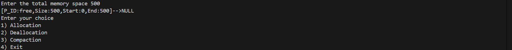
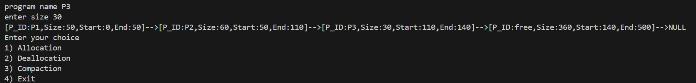
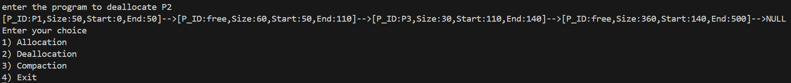
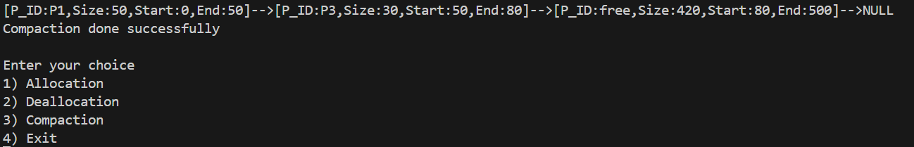

# MemoryAllocationStrategies_Stimulator
C++ Memory Allocation Simulator implementing First Fit, Best Fit &amp; Worst Fit algorithms using linked lists. Interactive terminal interface with real-time memory visualization showing allocation, deallocation &amp; compaction operations. Demonstrates core OS memory management concepts through practical implementation.
# 🧠 Memory Allocation Strategies Simulator

[](https://www.cplusplus.com/)
[](https://en.wikipedia.org/wiki/Memory_management)
[](https://en.wikipedia.org/wiki/Linked_list)


> A C++ implementation demonstrating memory allocation and management using linked lists with interactive terminal interface for real-time memory visualization.

## 📋 Table of Contents

- [🎯 Project Overview](#-project-overview)
- [✨ Features](#-features)
- [🏗️ Architecture](#️-architecture)
- [🚀 Quick Start](#-quick-start)
- [💡 Memory Management Implementation](#-memory-management-implementation)
- [🎮 Usage Examples](#-usage-examples)
- [📸 Screenshots](#-screenshots)
- [🛠️ Technical Implementation](#️-technical-implementation)


## 🎯 Project Overview

This project implements a memory allocation simulator using C++ and linked lists to demonstrate fundamental memory management concepts used in Operating Systems. The interactive terminal-based application allows users to allocate, deallocate, and compact memory while visualizing the real-time changes in memory blocks.

### 🎯 Key Objectives

- **Educational**: Demonstrate core OS memory management concepts
- **Interactive**: Real-time visualization of memory state changes
- **Practical**: Hands-on implementation of linked list data structures
- **Visual**: Clear representation of memory allocation patterns

## ✨ Features

### 🔧 Core Functionality
- **Memory Allocation**: Dynamic allocation of memory blocks to processes
- **Memory Deallocation**: Release allocated memory blocks back to free pool
- **Memory Compaction**: Defragmentation to combine free memory blocks
- **Interactive Menu System**: Simple numbered menu for easy operation selection

### 📊 Advanced Features
- **Linked List Visualization**: Real-time display of memory blocks as connected nodes
- **Address Management**: Automatic calculation of start and end addresses
- **Fragmentation Handling**: Visual demonstration of memory fragmentation and compaction
- **Process Tracking**: Individual process identification and management

### 🎨 User Experience
- **Simple Menu Interface**: Numbered menu options (1-4) for easy navigation
- **Linked List Visualization**: Real-time display of memory blocks as linked nodes
- **Terminal-Based Output**: Clean console interface showing memory state changes
- **Cross-platform Compatibility**: Works on Windows, Linux, and macOS

## 🏗️ Architecture

```
┌─────────────────────────────────────────────────────────────┐
│                    Memory Allocator                         │
├─────────────────────────────────────────────────────────────┤
│                 Linked List Manager                         │
│  ┌─────────────────────────────────────────────────────────┐ │
│  │ Node: [PID | Size | Start | End | Next]                │ │
│  └─────────────────────────────────────────────────────────┘ │
├─────────────────────────────────────────────────────────────┤
│                 Memory Visualizer                           │
│            Console Interface & User Input                   │
└─────────────────────────────────────────────────────────────┘
```

## 🚀 Quick Start

### Prerequisites
```bash
# C++ Compiler (GCC/MinGW/Clang)
g++ --version

# Or Visual Studio with C++ support
```

### Installation & Setup
```bash
# Clone the repository
git clone https://github.com/yourusername/memory-allocation-simulator.git
cd memory-allocation-simulator

# Compile the project
g++ -std=c++17 -o memory_simulator main.cpp

# Run the simulator
./memory_simulator
```

### Quick Demo
```bash
# Example session (Based on actual implementation)
program name p1
enter size 20
[P_ID:p1,Size:20,Start:0,End:20]-->[P_ID:free,Size:480,Start:20,End:500]-->NULL

enter your choice
1) allocation
2) deallocation  
3) compaction
4) exit
```

## 💡 Memory Management Implementation

### 🔗 Linked List Structure
The simulator uses a linked list where each node represents a memory block:
```cpp
Class node {
    string program;      // Program name (e.g., "p1", "p2") 
    int size;            // Block size in memory units
    int address;         // Memory address
    node* next;          // Pointer to next block
};
```

### 📊 Memory Visualization
The program displays memory state as a linked list:
```
[P_ID:p1,Size:20,Start:0,End:19]-->[P_ID:free,Size:480,Start:20,End:499]-->NULL
```

### 🎯 Core Operations
- **Allocation**: Finds suitable free block and splits if necessary
- **Deallocation**: Marks block as free and merges adjacent free blocks
- **Compaction**: Moves all allocated blocks together, combining free space

## 🎮 Usage Examples

### Basic Operations
```bash
# Allocate memory
program name p1
enter size 20
[P_ID:p1,Size:20,Start:0,End:20]-->[P_ID:free,Size:480,Start:20,End:500]-->NULL

# Menu options
Enter your choice
1) Allocation
2) Deallocation  
3) Compaction
4) Exit

# Example memory state visualization
[P_ID:p1,Size:20,Start:0,End:19]-->[P_ID:p2,Size:50,Start:20,End:69]-->[P_ID:free,Size:430,Start:70,End:499]-->NULL
```

### Advanced Scenarios
```bash
# Simulate multiple allocations
program name p1
enter size 100
[P_ID:p1,Size:100,Start:0,End:99]-->[P_ID:free,Size:400,Start:100,End:499]-->NULL

program name p2  
enter size 50
[P_ID:p1,Size:100,Start:0,End:99]-->[P_ID:p2,Size:50,Start:100,End:149]-->[P_ID:free,Size:350,Start:150,End:499]-->NULL

# After deallocation (creates fragmentation)
# Choice 2) deallocation - deallocate p1
[P_ID:free,Size:100,Start:0,End:99]-->[P_ID:p2,Size:50,Start:100,End:149]-->[P_ID:free,Size:350,Start:150,End:499]-->NULL

# After compaction
# Choice 3) compaction
[P_ID:p2,Size:50,Start:0,End:49]-->[P_ID:free,Size:450,Start:50,End:499]-->NULL
```

## 📸 Screenshots


*Main menu interface showing allocation options*

 
*Memory state after allocating process P1 with size 50 , P2 with 60 and P3 with 30*

 
*Memory state after deallocating process P2 of size 60*


*Memory layout before and after compaction operation*

## 📊 Features & Implementation

### Algorithm Complexity
- **Space Complexity**: O(n) where n is the number of memory blocks
- **Time Complexity**:
  - Allocation: O(n) - traverses list to find suitable block
  - Deallocation: O(n) - finds block and merges adjacent free blocks
  - Compaction: O(n) - reorganizes all allocated blocks

### Design Patterns Used
- **Menu-Driven Architecture**: Simple numbered menu interface
- **Linked List Management**: Dynamic memory block representation
- **State Visualization**: Real-time memory layout display

## 🔧 Installation Requirements

### System Requirements
- **Operating System**: Windows 10+, Linux, macOS
- **Compiler**: GCC 7.0+, Clang 6.0+, or Visual Studio 2017+
- **C++ Standard**: C++11 or higher
- **Memory**: Minimal (console application)

### Compilation Commands
```bash
# Basic compilation
g++ -o memory_simulator main.cpp

# With debugging symbols
g++ -g -o memory_simulator main.cpp

# With optimizations
g++ -O2 -o memory_simulator main.cpp

# Cross-platform compilation
g++ -std=c++11 -Wall -o memory_simulator main.cpp
```

## 🏆 Learning Outcomes

### Technical Skills Demonstrated
- **C++ Programming**: Object-oriented design, pointers, memory management
- **Data Structures**: Linked list implementation and manipulation
- **Operating Systems**: Memory allocation concepts and strategies
- **Problem Solving**: Algorithm design for memory management

### Key Concepts Covered
- Dynamic memory allocation and deallocation
- Memory fragmentation and compaction
- Linked list traversal and manipulation
- User interface design for system software
- Address calculation and memory mapping


